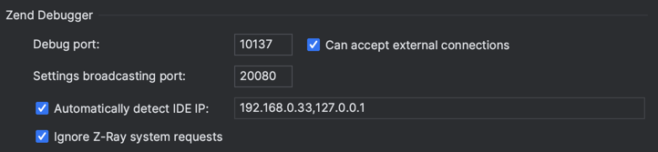

# Cài đặt

## Chuẩn bị môi trường

```bash
cp .env.example .env 
```

## Cấu hình xdebug



* XDEBUG_CONFIG="client_host=192.168.0.33 client_port=9000 idekey=PHPSTORM"
* client_host: là ip riêng máy chủ của bạn. VD phpstorm lấy ip tại Setting > PHP > Debug > Zend Debugger 
* Ở hình trên client_host sẽ là 192.168.0.33


## Build Docker images and containers

```bash
cp docker-compose-local.yml docker-compose.override.yml
docker compose build
docker compose up --no-start
```

Chạy dịch vụ

```bash
docker compose up -d
```
